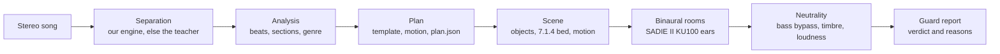

# SoundStage

**A spatial audio engine that lives inside the music app: any song, any phone, no Dolby hardware, artist in control.**

[](https://github.com/danielomoteshohacks/stage-spatial-audio/actions/workflows/ci.yml)
[](LICENSE)


> SoundStage is an independent research and engineering project. It is not affiliated with, or endorsed by, Spotify, Apple or Dolby.

---

## Why this exists

Streaming services now compete on sound. Lossless audio has become common, and spatial audio is the
next gap. Today, spatial music mostly means a dedicated Dolby Atmos mix of each song, and on
Android the experience also depends on the phone maker supplying Dolby support: without it, the
same track plays in plain stereo. Spotify offers lossless, and as of early 2026 no native spatial format.

SoundStage asks a different question: **what if the app itself owned the renderer?** Then it would work on any
phone, on any song, and the artist could decide whether their track receives it.

## The idea in one minute

Most upmixers invent positions. SoundStage does the opposite: **it keeps every sound where the
mix put it**, splits the song into its parts, and builds a scene around the listener from them,
through measured human-ear filters in a real-sounding room. The vocal, the bass and the kick never
move; below 120 Hz the record passes through untouched. A fidelity guard compares every render
with the original and says what it found.


```mermaid
flowchart LR
    A[Stereo song] --> B[Separation<br/>our engine, else the teacher]
    B --> C[Analysis<br/>beats, sections, genre]
    C --> D[Plan<br/>template, motion, plan.json]
    D --> E[Scene<br/>objects, 7.1.4 bed, motion]
    E --> F[Binaural rooms<br/>SADIE II KU100 ears]
    F --> G[Neutrality<br/>bass bypass, timbre, loudness]
    G --> H[Guard report<br/>verdict and reasons]
```

## Three complete tiers

| Tier | Neural network | Runs where | What it adds |
|---|---|---|---|
| **Lite** | None | On the device, real time | Pan-anchored rendering of the whole mix; works on any song instantly |
| **Standard** | Small separation model | Offline, once per track | Per-stem roles and distances |
| **Studio** | Separation plus refiner | Offline, once per track | Cleaner stems on hard passages, for flagship tracks |

Each tier is a complete product, not a stripped-down demo. Every tier must beat the one below it in
blind listening tests to earn its cost.

## How we know it works

No claim is made without a measurement. Each claim is a hypothesis with a pass condition written
before the test is run (see [`experiments/`](experiments/)).

| Claim | Gate |
|---|---|
| Lite is preferred over a generic stereo virtualiser | Lower end of the 95 percent interval above 50 percent |
| The timbre bound keeps the tone without losing direction | Average deviation at most 1.5 dB |
| Role-based distance beats one room for everything | Preferred in blind A/B |
| The real-time core is light | WebAssembly at most 300 KB; CPU at most 5 percent of one mid-range phone core |
| Triage-and-refine keeps the ensemble's gain cheaply | At least 90 percent of the gain at no more than 40 percent of the cost |

Results, including failures, will be published here with sample sizes and confidence intervals.

## Try it

On a phone with headphones: <https://soundstage-phi.vercel.app>. Drop a song you own, wait for
the stage to be built, and switch between Original and Spatial. The processing server is
<https://danieltesh-soundstage.hf.space> (a sleeping Space takes a minute to wake).

On your own machine, in two terminals (Python 3.10+, Node 20+):

```bash
python -m pip install -e ".[backend]"   # add ",separation" for stems (installs torch, demucs)
python space/app.py                      # http://127.0.0.1:7860
cd web && npm ci && npm run dev          # http://localhost:5173
```

From the command line, without the web app:

```bash
python scripts/process_track.py track.flac --mode lite --profile space:living_room --out-dir runs/a
```

Tracks are processed and deleted after 30 minutes; use audio you own or may use.

## Status

v2 is live: <https://soundstage-phi.vercel.app> (web app) and
<https://danieltesh-soundstage.hf.space> (processing). What exists, honestly:

- **Real ears and rooms** (decisions 0012 to 0014): head-related filters built from the SADIE II
  KU100 measurements on GitHub Actions; six spaces with image-source reflections and a late field
  matched to the head's measured diffuse coherence; the studio fitted to the measured York BRIRs.
- **The scene and the plan** (0016 to 0018): stems split into direct, ambient and transient
  parts, placed as objects with a surround and height bed, tempo-locked motion with a speed cap,
  ten genre templates, an editable plan.json.
- **Fidelity guard** (0011): BS.1770 loudness, true peak, bass identity, timbre, timestamped
  artifact flags, a verdict with reasons, on every render.
- **Our separator** (0015): the engine, training code and Kaggle notebook are done and tested;
  **its weights are not trained yet**. Until its evaluation reaches htdemucs, the Space uses
  htdemucs, and run.json says which separator ran.
- **The product** (0020): new brand, library on the phone, cover-art colours, stage view, Feel,
  blind test. Head tracking is designed, not shipped.
- **Not claimed:** no perceptual result yet. The numbers below are objective proxies; the blind
  test decides.

## Benchmark: v1 against v2

Five generated multitrack songs (synthesised drums, bass, chords, a formant voice, ambience; no
recordings), 30 s each, `scripts/benchmark_spatial.py`, means (decision 0021):

| Metric | Better | v1 Lite | v2 Lite | v2 stems, studio | v2 stems, living room (default) |
|---|---|---|---|---|---|
| IACC | lower | 0.956 | 0.887 | 0.973 | **0.830** |
| ITD spread (us) | higher | 96.5 | 184 | 103 | **273** |
| ILD spread (dB) | higher | 7.19 | 5.96 | 6.46 | **7.60** |
| DRR estimate (dB) | lower: more room | 7.19 | 15.4 | 7.53 | **3.09** |
| Lateral energy | higher | 0.0068 | **0.118** | 0.0094 | 0.0804 |
| Interaural coherence | lower | 0.949 | **0.419** | 0.965 | 0.759 |
| Timbre deviation (dB) | lower | 4.45 | 1.20 | **0.95** | 2.39 |
| Artifact flags per 30 s | lower | 18.2 | **0** | **0** | **0** |
| Bass correlation (< 120 Hz) | higher | 0.999 | **1.000** | **1.000** | **1.000** |
| Loudness difference (LU) | lower | 0.046 | **0** | **0** | **0** |
| Render time, 30 s, 4 vCPU (s) | lower | **1.8** | 4.0 | 8.8 | 8.8 |
| Guard verdict | | 5 review | 5 pass | 5 pass | 5 pass |

Where v2 does not win, decision 0021 says why (render time; the deliberately dry studio).

## Separation

| Engine | Avg SDR, MUSDB18-HQ test | Size | CPU per 30 s | Status |
|---|---|---|---|---|
| htdemucs (teacher fallback) | 9.0 dB (Demucs README) | measured on Kaggle | GPU on the Space | in use |
| SoundStage Separator | not trained yet | 8.4 MB (fp16 ONNX) | 9.8 s on 4 vCPU | default only once it reaches htdemucs |

MUSDB18-HQ is for research use only; weights trained on it are research weights. The training
steps for Kaggle's free GPUs are in [`training/README.md`](training/README.md).

## Repository layout

| Path | Purpose | Status |
|---|---|---|
| [`src/stage/`](src/stage/) | Python reference implementation (the oracle) | active |
| [`schemas/`](schemas/) | JSON Schemas for the plan, report, run and consent files | active |
| [`tests/`](tests/) | Unit, property, golden-file and integration tests | active |
| [`docs/`](docs/) | Specifications, architecture, roadmap, decision records | active |
| [`experiments/`](experiments/) | Hypotheses, gates and results | active |
| [`stage-core/`](stage-core/) | Rust real-time core, compiled to WebAssembly | planned |
| [`tools/hrtf-pack/`](tools/hrtf-pack/) | Builds the measured HRTF pack from SADIE II (on GitHub Actions) | active |
| [`training/`](training/) | SoundStage Separator training (Kaggle) and export | active |
| [`web/`](web/) | The web app: library, player, stage view, blind test | active |
| [`space/`](space/) | Gradio backend for a laptop or a Hugging Face Space | active |
| [`android/`](android/) | Optional Android client | planned |
| [`configs/`](configs/) | Genre templates, spaces, guard thresholds | active |
| [`models/`](models/) | Model and dataset manifest (files are never committed) | active |
| [`data/`](data/) | Dataset licences (audio is never committed) | active |
| [`benchmarks/`](benchmarks/) | Reproducible performance measurements | active (Python) |
| [`examples/`](examples/) | Small runnable examples | planned |
| [`scripts/`](scripts/) | Processing, rendering, blind-test and test-signal helpers | active |

## Quick start

```bash
git clone https://github.com/danielomoteshohacks/stage-spatial-audio.git
cd stage-spatial-audio
python -m venv .venv
source .venv/bin/activate          # Windows Git Bash: source .venv/Scripts/activate
python -m pip install -e ".[dev]"
ruff check . && pytest -q
```

## Documentation

- [`docs/specs/`](docs/specs/): the project plan and the technical build specification (version 2)
- [`docs/architecture.md`](docs/architecture.md): the system and its data contracts
- [`docs/decisions/`](docs/decisions/): why each major choice was made, and what else was considered
- [`docs/roadmap.md`](docs/roadmap.md): the five slices
- [`docs/log.md`](docs/log.md): the build log, with every measurement and limitation

## Principles

- **True to the record.** Change position, not the performance.
- **Measured.** Report sample sizes and intervals, including failures.
- **Light.** Heavy work runs offline; what runs on the device stays small.
- **Open and clean.** Only audio that is owned or licensed; every model and dataset licence is recorded.
- **Artist in control.** Spatial processing is opt-in with preview and approval.

## Music, data and licensing policy

- No audio, models or datasets are committed. Manifests record source and licence.
- Only music that is owned, used with written permission, or openly licensed appears in demos.
- Spotify audio, previews and API data are **never** used for training, testing or demos.
- Pretrained model weights are treated as research-only until their licence is confirmed.

## Prior art and acknowledgements

SoundStage builds on established research and says so: panning-index and ambience extraction
(Avendano and Jot), azimuth discrimination and resynthesis (Barry and colleagues), primary-ambient
extraction (He, Tan and Gan, and others), stereo position estimation (Kraft and Zolzer), source
separation models (Demucs, SCNet, RoFormer families), and open head-related transfer function
datasets (used with attribution).

**Credits.** The default head-related filters are built from the SADIE II Database, subject D1
(Neumann KU100), The Audio Lab, University of York: C. Armstrong, L. Thresh, D. Murphy and
G. Kearney, "A Perceptual Evaluation of Individual and Non-Individual HRTFs: A Case Study of the
SADIE II Database", Applied Sciences 8(11), 2029, 2018. Copyright 2018 University of York,
licensed under the Apache License 2.0. Every model and dataset is listed with its licence in
[`models/MANIFEST.md`](models/MANIFEST.md). Some structures used in commercial binaural virtualisers are
patented; SoundStage avoids copying them and a freedom-to-operate check is planned before any product claim.

## Contributing

See [`CONTRIBUTING.md`](CONTRIBUTING.md). Experiments use the Experiment issue template.

## Licence

Code is licensed under [Apache-2.0](LICENSE). Models and datasets keep their own licences.
